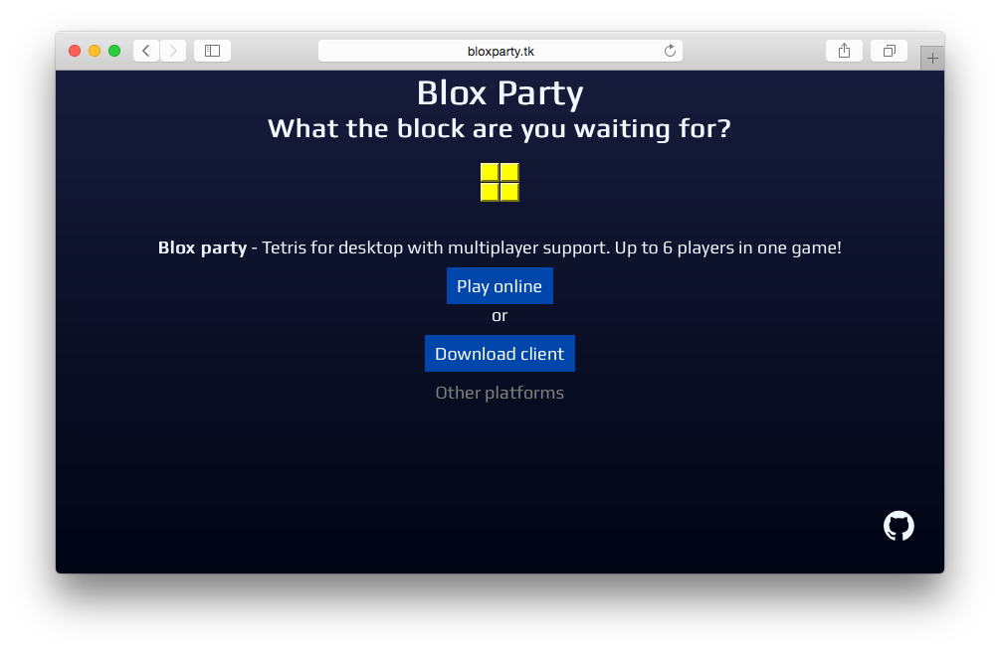

[Download the latest release](https://github.com/bloxparty/bloxparty/releases)

**List of public servers:**

- `bloxparty-server.kvnneff.me`

## Dev

**Commands:**

* Init: `npm install`
* Build JS: `gulp compile`

## See Also

* [bloxparty-client](https://github.com/bloxparty/bloxparty): Electron-based desktop client
* [bloxparty-server](https://github.com/bloxparty/bloxparty-server): Server for hosting games
* [bloxparty-board](https://github.com/bloxparty/bloxparty-board): Core game logic

## License

[MIT](LICENSE)